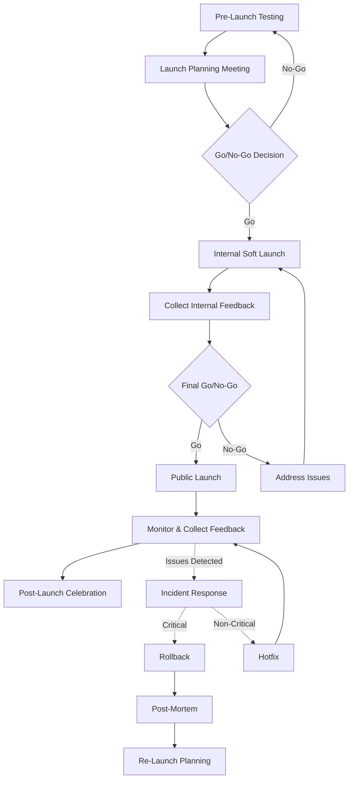

# Index Dokumen Peluncuran Fitur Leaderboard InfoPekerjaan.id

## Daftar Dokumen dan Fungsinya

| No | Nama File | Deskripsi | Tahap Peluncuran |
|----|-----------|-----------|------------------|
| 1 | `leaderboard_responsiveness_checklist.csv` | Checklist pengujian responsivitas dengan 33 item untuk mobile, tablet, dan cross-device | Pre-Launch: Testing |
| 2 | `checklist_instructions.md` | Panduan cara menggunakan checklist pengujian | Pre-Launch: Testing |
| 3 | `leaderboard_testing_final_report.md` | Laporan komprehensif hasil pengujian dengan semua metrik dan rekomendasi | Pre-Launch: Testing |
| 4 | `leaderboard_launch_plan.md` | Strategi peluncuran bertahap (internal dan public) dengan timeline | Pre-Launch: Planning |
| 5 | `leaderboard_launch_day_checklist.md` | Checklist terperinci untuk hari-H peluncuran dengan timeline per jam | Launch: Execution |
| 6 | `leaderboard_announcement_templates.md` | Template komunikasi untuk email, in-app notification, dan media sosial | Launch: Communication |
| 7 | `leaderboard_monitoring_plan.md` | Rencana monitoring pasca-peluncuran dengan metrik dan threshold | Post-Launch: Monitoring |
| 8 | `leaderboard_feedback_form.md` | Template form feedback pengguna dan strategi distribusinya | Post-Launch: Feedback |
| 9 | `leaderboard_celebration_announcement.md` | Template pengumuman perayaan untuk top achievers | Post-Launch: Engagement |
| 10 | `leaderboard_rollback_plan.md` | Prosedur rollback terstruktur dengan kriteria dan template komunikasi | Contingency |
| 11 | `leaderboard_execution_templates.md` | Template praktis untuk eksekusi setiap tahap peluncuran | All Phases |

## Panduan Penggunaan Dokumen

### 1. Fase Pre-Launch
1. Mulai dengan `leaderboard_responsiveness_checklist.csv` dan `checklist_instructions.md` untuk validasi akhir responsivitas
2. Kompilasi hasil pengujian ke dalam `leaderboard_testing_final_report.md`
3. Review `leaderboard_launch_plan.md` untuk memahami strategi peluncuran keseluruhan

### 2. Fase Soft Launch (Internal)
1. Gunakan template dari `leaderboard_execution_templates.md` untuk pengumuman internal
2. Aktifkan monitoring sesuai `leaderboard_monitoring_plan.md` (skala terbatas)
3. Kumpulkan feedback dari tim internal
4. Lakukan meeting Go/No-Go menggunakan template agenda dari `leaderboard_execution_templates.md`

### 3. Fase Public Launch
1. Ikuti `leaderboard_launch_day_checklist.md` pada hari-H peluncuran
2. Kirim pengumuman menggunakan template dari `leaderboard_announcement_templates.md`
3. Pantau metrik sesuai `leaderboard_monitoring_plan.md`
4. Siagakan `leaderboard_rollback_plan.md` jika diperlukan

### 4. Fase Post-Launch
1. Distribusikan `leaderboard_feedback_form.md` untuk mengumpulkan feedback pengguna
2. Analisis hasil dan engagement dari fitur
3. Gunakan `leaderboard_celebration_announcement.md` untuk mengumumkan top achievers
4. Lakukan evaluasi keseluruhan peluncuran

## Rekomendasi Alur Kerja Tim

## Kontak Tim

| Peran | Kontak | Area Tanggung Jawab |
|-------|--------|---------------------|
| Product Owner | [Nama & Kontak] | Keseluruhan peluncuran dan keputusan bisnis |
| Technical Lead | [Nama & Kontak] | Implementasi teknis dan stabilitas |
| QA Lead | [Nama & Kontak] | Pengujian dan validasi kualitas |
| UX Lead | [Nama & Kontak] | Pengalaman pengguna dan responsivitas |
| DevOps | [Nama & Kontak] | Deployment dan monitoring |
| Marketing | [Nama & Kontak] | Komunikasi dan pengumuman |
| Customer Support | [Nama & Kontak] | Feedback pengguna dan dukungan |

---

Dokumen ini berfungsi sebagai index untuk semua dokumen peluncuran fitur Leaderboard InfoPekerjaan.id. Pastikan selalu merujuk ke versi terbaru dari setiap dokumen untuk informasi yang akurat.

**Tanggal Dokumen**: April 2025  
**Versi**: 1.0  
**Tim**: Release Management InfoPekerjaan.id